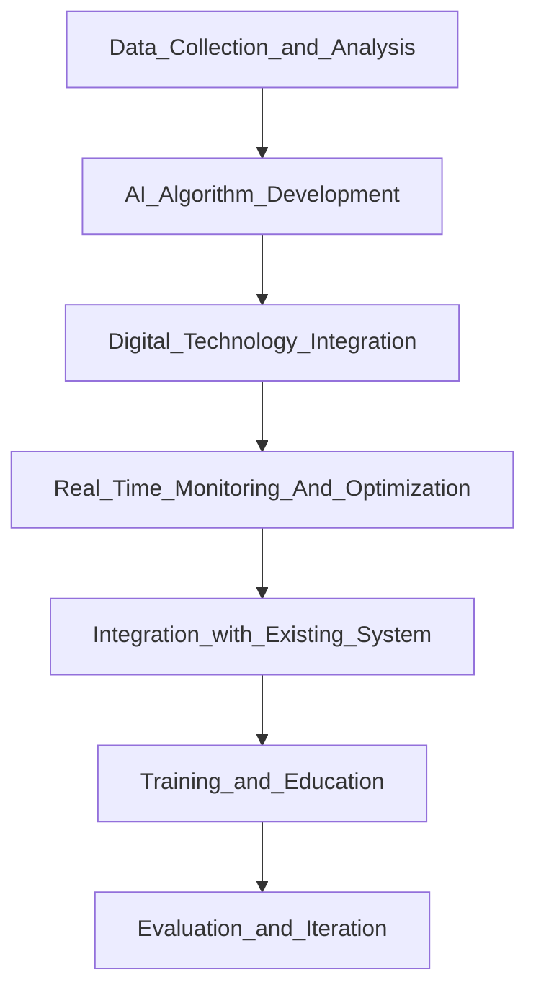

# Optimizing doctor availability and appointment in hospital through digital technology and AI integration.

## Goal Definition:
The main objective of the website is to help with the current challenges and opportunities in doctor availability and allocation within the hospital such as, reducing wait times for patients, optimizing doctor schedules,showing the availability of hospitals and doctors.

## Data Collection and Analysis:
Gather relevant data on patient flow, doctor schedules, historical patient records.

## AI Algorithm Development:
Develop AI algorithms to predict patient demand, optimize doctor schedules, and allocate resources efficiently.

## Digital Technology Integration:
Implement digital platforms, scheduling, and information sharing among doctors, staff, and patients.
Develop user-friendly interfaces for doctors to access patient information, manage schedules, and communicate with colleagues.

## Real-Time Monitoring and Optimization:
Implement systems for real-time monitoring of patient flow, doctor availability, and resource utilization.
Use AI to adjust schedules, allocate resources, and respond to changing demands in real-time.

## Integration with Existing Systems:
Ensure integration with existing hospital management systems, health records, and other relevant technologies.
Collaborate with departments and vendors to ensure smooth implementation.

## Training and Education:
Provide training and education to doctors, staff on how to use the new digital tools and AI effectively.
Emphasize the benefits of the system in improving efficiency, reducing workload, and enhancing patient care.

## Evaluation and Iteration:
Continuously monitor the performance of the system and gather feedback.
Evaluate the impact of the project such as wait times, patient satisfaction, and doctor workload.
By following this project logic, hospitals can leverage digital technology and AI integration to optimize doctor availability and allocation, ultimately improving patient care and operational efficiency.
